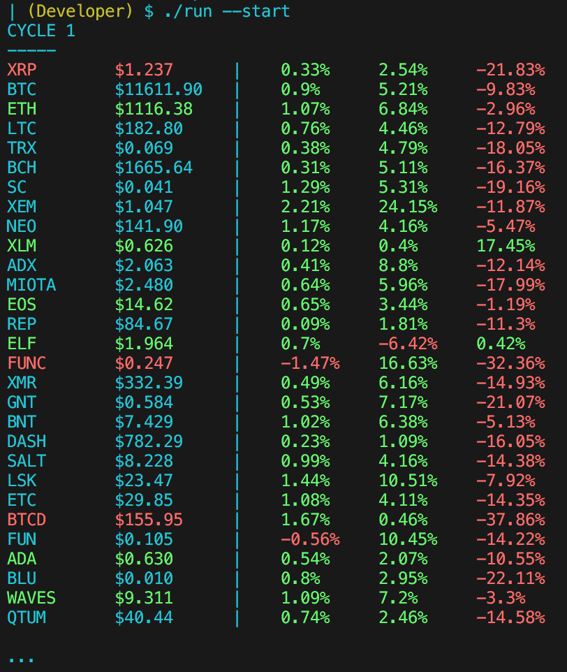

# Coinwatch

Overview
---
A cryptocurrency trend tracker that uses statistics to illuminate price-action 
trends via statistical analysis and trade monitoring.


Setup
---
```
git clone https://github.com/bitforce/Coinwatch
cd Coinwatch/
./install
```

Usage
---
see `coinwatch --help`

Note
---
This program will create the watchlists in the current directory (wherever you run it), unless 
specified by the `--set-path` option. If you're not sure where the data is being read/written, 
use the `--get-path` option to find out. You can also search this in the configuration file: 
_.coinwatch.conf_; located in the home directory.

All data that you get through the program is relative; while there exist advantages with this 
form of tracking, a major complication is relative asset value, as for example, say the all-
time high for a currency you are monitoring may not be the actual coin's ATH, as perhaps you 
may have only a certain amount of historical data and it doesn't go back far enough to 
measure this.

When using the --high/low, enter the coin's ticker symbol, not the name

License
---
Licensed under the WTFPL - see [LICENSE](./doc/LICENSE) for explicit details.

Version
---
1.0.0

Author
---
[LinkedIn](https://www.linkedin.com/in/brandonjohnsonxyz/)
[GitHub](https://github.com/bitforce)
[Site](brandonjohnson.life)
